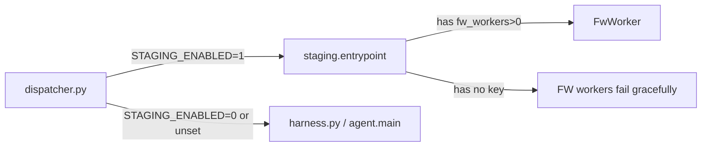

# Fireworks API Integration Status

> **Date:** 2026-07-13
> **Scope:** All code paths that touch the Fireworks AI inference API

---

## 1. Overview

Fireworks API is used in two distinct pipeline paths:

| Pipeline | Entrypoint | Uses Fireworks For |
|----------|-----------|-------------------|
| **Legacy** | `agent/main.py` (via `dispatcher.py`) | Sentiment tasks only (FIREWORKS_CATEGORIES) |
| **Staging** | `staging/entrypoint.py` (via `dispatcher.py` when STAGING_ENABLED=1) | FwWorker (5 temp sweeps) + Judge escalation (consensus failover) |

All HTTP calls route through `agent/solvers/fireworks.py` → `FireworksSolver.solve()` using stdlib `urllib` only.

---

## 2. FireworksSolver (`agent/solvers/fireworks.py`)

### Constructor — API Key Handling

```python
def __init__(self, api_key: Optional[str] = None):
    self.api_key = api_key or os.environ.get("FIREWORKS_API_KEY", "")
    if not self.api_key:
        logger.warning("FIREWORKS_API_KEY not set")
```

**✅ Properly handles empty keys:** Warns but does not crash. The `solve()` call will proceed with an empty bearer token and get a 401 Unauthorized from the API, but the caller is responsible for catching that (see below).

### Error Handling in `solve()`

- `HTTPError` (4xx, 5xx): Logged with status code and response body, then **re-raised**
- `URLError` (connection/network): Logged with reason, then **re-raised**
- Generic `Exception`: Logged, then **re-raised**

**⚠️ The solver never catches its own errors** — every caller must wrap it in try/except.

### Reasoning Effort Logic

- `REASONING_EFFORT_MODELS = {"minimax", "gpt-oss", "gptoss"}` — these models get `reasoning_effort` parameter
- `minimax` always gets `"none"` to suppress hidden reasoning token burn
- Other reasoning-effort models get `"low"`
- `kimi` gets `reasoning_effort = "none"` only for `{ner, sentiment, code, summarization}` task types
- All other models/models don't get the parameter at all (avoids API rejection)

---

## 3. FwWorker (`staging/workers/fw_worker.py`)

### Architecture

- Spawned by `ReadyPool._build_worker_plan()` when `config.fw_workers > 0`
- Each worker picks a model from `config.fw_models` via round-robin (worker_index % len(models))
- Default model list: `["accounts/fireworks/models/deepseek-v4-flash"]`

### Error Handling

```python
try:
    answer = self._solver.solve(...)
except Exception as exc:
    logger.warning("[%s] FW try %d failed for task %s: %s", ...)
    answer = ""
```

**✅ Graceful degradation:** All exceptions are caught, logged, and the answer becomes `""`. The 5 temperature sweeps continue even if one fails.

**❌ No rate-limit handling:** Despite the docstring claiming "Handles rate limiting with exponential backoff", **there is zero backoff or retry logic**. A 429, 5xx, or timeout simply produces an empty answer for that attempt. If all 5 tries hit rate limits, all 5 answers are empty.

**❌ No 429/5xx/timeout differentiation:** All exceptions are caught identically. No attempt to sleep-and-retry on 429, no retry on transient 5xx, no timeout-specific handling.

**✅ Fast mode:** `_process_single()` (for deadline emergencies) has the same error handling pattern.

---

## 4. Judge Escalation (`staging/ready_judge.py`)

### `_escalate_to_fireworks()`:

```python
if not self.config.fw_api_key:
    logger.warning("[judge] No Fireworks API key — skipping")
    return ""
```

**✅ Early return on missing key:** Clean bail-out, no crash.

**✅ Exception-safe:** Wrapped in try/except (ImportError + Exception) → returns `""` on any failure.

```python
# Re-check: if escalation returned empty, fallback to best available
if not final_answer.strip():
    strategy = "fallback_best"
    final_answer = best_available_answer
```

**✅ Fallback chain:** If Fireworks returns empty, the judge falls back to the best non-degenerate answer from the worker pool. No data loss.

### Trigger Conditions for Escalation

| Condition | Strategy |
|-----------|----------|
| 5 answers, 3 agree | `majority_3plus` — no escalation needed |
| 4+ answers, 2 agree | `majority_2plus` — no escalation needed |
| 3 answers, 2 agree | `majority_2of3` — no escalation needed |
| 2 answers, 1v1 split | `escalate_fireworks` |
| All answers different (any count) | `escalate_fireworks` |
| All answers degenerate/empty | `all_failed` — no escalation attempted |

---

## 5. Category Routing

### Staging Path — Worker Type Priority (`staging/ready_config.py`)

| Category | Priority 1 | Priority 2 | Priority 3 |
|----------|-----------|-----------|-----------|
| logic | **fireworks** | local | — |
| code_gen | **fireworks** | local | — |
| code_debug | **fireworks** | local | deterministic |
| math | deterministic | local | **fireworks** |
| factual | deterministic | **fireworks** | local |
| sentiment | deterministic | local | **fireworks** |
| ner | deterministic | **fireworks** | local |
| summarization | deterministic | **fireworks** | local |

### Staging Path — Model Selection (`agent/solvers/fw_router.py`)

| Category | Model | Max Tokens | Reasoning Effort |
|----------|-------|-----------|-----------------|
| sentiment | minimax-m3 | 20 | none |
| ner | minimax-m3 | 400 | none |
| factual | minimax-m3 | 500 | none |
| summarization | minimax-m3 | 500 | none |
| general | minimax-m3 | 200 | none |
| math | kimi-k2p7-code | 550 | — |
| code_gen | kimi-k2p7-code | 600 | — |
| code_debug | kimi-k2p7-code | 500 | — |
| logic | kimi-k2p7-code | 500 | — |

### Legacy Path — `agent/main.py`

```python
FIREWORKS_CATEGORIES = {"sentiment"}   # Only sentiment uses Fireworks
NAKED_CATEGORIES = {"ner", "factual", "logic", "math"}  # Bypass FW entirely
```

---

## 6. Test Coverage

### Existing Tests That Touch Fireworks

| File | What It Tests | Status |
|------|--------------|--------|
| `staging/test_judge.py` (175 lines) | Judge voting logic, fuzzy matching, escalation path (without API key) | ✅ Functional test, no external deps |
| `test_summarization_approaches.py` | Fireworks API summarization if key available | ⚠️ Optional, not automated |
| `tests/test_deploy.py` | Deploy/build pipeline only | ❌ No Fireworks logic tested |

### Missing Test Coverage

| Area | Missing |
|------|---------|
| `FireworksSolver` unit tests | ❌ No tests for: empty key, 401, 429, 5xx, timeout, network failure, reasoning_effort logic |
| `FwWorker` error handling | ❌ No tests for rate-limit backoff, all-failures path, _process_single |
| Mock-based integration tests | ❌ No mocked HTTP tests for any path |
| Judge escalation with API | ❌ No test verifying escalation works with a real/mocked key |

**Bottom line:** Only the judge's fallback path (without API key) is tested. The core HTTP client and worker have zero test coverage.

---

## 7. Failure Mode Analysis

### Scenario: Fireworks API Key Missing / Empty

| Layer | What Happens | Outcome |
|-------|-------------|---------|
| `FireworksSolver.__init__()` | Logs warning, stores `""` | ✅ No crash |
| `FwWorker.initialize()` | Creates solver with `""` key, logger warns | ✅ No crash |
| `FwWorker.process()` → `solve()` | Sends `Bearer ` → gets 401 → exception caught → returns `""` | ✅ Graceful |
| Judge escalation | Checks `fw_api_key == ""` → returns `""` → falls back to best answer | ✅ Graceful |
| **Accuracy impact** | FW workers produce empty answers; judge never escalates | ⚠️ Lower accuracy on categories where FW is primary (logic, code_gen) |

### Scenario: Fireworks API Down / 5xx

| Layer | What Happens | Outcome |
|-------|-------------|---------|
| `FwWorker` | HTTPError caught → `""` returned for each attempt | ✅ Graceful per-try |
| All 5 sweeps fail | 5 empty answers for that task | ⚠️ Judge may have no valid answers |
| Judge escalation | Exception caught → returns `""` → falls back | ✅ Graceful |
| No circuit breaker | FW worker keeps trying for every task (no cooldown) | ⚠️ Wastes time, delays fallback to local |

### Scenario: Rate Limiting (429)

| Layer | What Happens | Outcome |
|-------|-------------|---------|
| `FwWorker` | 429 → HTTPError caught → `""` returned | ⚠️ No backoff/retry |
| 5 consecutive sweeps | All 5 likely hit rate limit → no answers | ⚠️ Same as "all empty" path |

### Scenario: Timeout

| Layer | What Happens | Outcome |
|-------|-------------|---------|
| `FireworksSolver.solve(timeout=29)` | URLError (timeout) → caught → re-raised | Depends on caller |
| `FwWorker` catches it | Returns `""` | ✅ Graceful |
| Judge escalation catches it | Returns `""` → falls back | ✅ Graceful |

### Key Findings

1. **No crash in any Fireworks failure scenario** — all paths robustly handle errors
2. **No exponential backoff for rate limiting** despite docstring claiming otherwise
3. **No circuit breaker** in staging path for Fireworks (legacy path has `RemoteBreaker`)
4. **Fireworks failures silently degrade accuracy** — no alert mechanism
5. **Staging path has 0 retries** on transient Fireworks failures

---

## 8. Can Staging Run Without Fireworks? (CPU-Only, No API Key)

**✅ YES, fully supported.** No code changes needed.

### Required Env Vars

```bash
STAGING_FW_WORKERS=0       # Don't spawn any FwWorker processes
FIREWORKS_API_KEY=""        # Or unset/leave empty
```

### What Happens

1. `ReadyConfig.from_env()` defaults: `fw_workers=1`, `fw_api_key=""`
2. Default config has `fw_workers=1` → one FwWorker would start with empty key
3. With `STAGING_FW_WORKERS=0`, no FwWorker is spawned
4. Deterministic (2) + Local (1) workers handle all tasks
5. Judge's `_active_worker_types` never includes "fireworks"
6. Judge `_escalate_to_fireworks()` returns `""` early (no key) → falls back
7. Category priority still references "fireworks" for some categories but with no FW workers, those get handled by lower-priority workers

### Accuracy Implication

Categories where Fireworks is the **primary** solver will rely on local model (Qwen2.5-1.5B) or deterministic solvers:

| Category | Without FW | Expected Accuracy Impact |
|----------|-----------|------------------------|
| logic | Falls to local LLM | ⚠️ Moderate negative |
| code_gen | Falls to local LLM | ⚠️ Significant negative |
| code_debug | Falls to local LLM, then det | ⚠️ Moderate negative |
| ner, factual, summarization | Det first, then local | ✅ Minimal (det already first) |
| math | Det first, then local | ✅ Minimal (det already first) |
| sentiment | Det first, then local | ✅ Minimal (det already first) |

---

## 9. Container Image Configuration

| Dockerfile | Tag/Use | N_GPU_LAYERS | Entrypoint | Notes |
|-----------|---------|-------------|------------|-------|
| `Dockerfile` | Submission (legacy) | `-1` (all GPU) | `dispatcher.py` | GPU layers set but grader has no GPU → uses CPU fallback in llama.cpp |
| `Dockerfile.staging` | Staging submission | `0` (CPU) | `dispatcher.py` → `staging.entrypoint` when STAGING_ENABLED=1 | Correct CPU config for submission |
| `Dockerfile.gpu` | Local GPU testing | `-1` (all GPU) | `staging.entrypoint` directly | NOT for submission; uses CUDA |

**Important:** Neither Dockerfile hardcodes `FIREWORKS_API_KEY`. It is always injected at runtime via environment variable by the grader. The `gpu-test` image (Dockerfile.gpu) also expects it as a runtime env var, not baked in.

### Legacy vs Staging Dispatch



---

## 10. Recommendations

1. **Remove misleading docstring** in `fw_worker.py` line 6 — there is no exponential backoff
2. **Add retry with backoff** for 429 and transient 5xx in `FwWorker.process()` (or in `FireworksSolver.solve()`)
3. **Add circuit breaker** for Fireworks in the staging monitor (similar to legacy's `RemoteBreaker`)
4. **Add unit tests** for `FireworksSolver` with mocked HTTP responses (401, 429, 5xx, timeout, success)
5. **Add mock-based test** for `FwWorker` error paths
6. **Consider setting `STAGING_FW_WORKERS=0` as default** when `FIREWORKS_API_KEY` is empty, to avoid spawning doomed FW worker processes
7. **Log Fireworks failure counts** at the monitor level so silent degradation is visible
